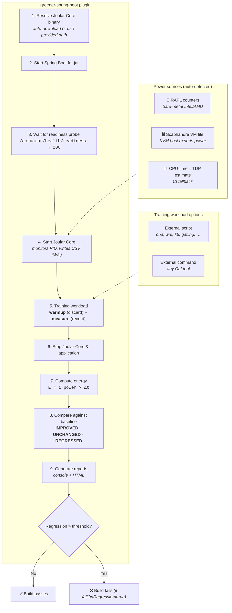

# greener-spring-boot ⚡

> Maven and Gradle plugins to measure the energy consumption of Spring Boot applications
> using [Joular Core](https://github.com/joular/joularcore),
> compare results against a stored baseline, and fail the build on regressions.

[](https://github.com/patbaumgartner/greener-spring-boot/actions/workflows/ci.yml)
[](https://github.com/patbaumgartner/greener-spring-boot/actions/workflows/codeql.yml)
[](https://github.com/patbaumgartner/greener-spring-boot/actions/workflows/energy-baseline.yml)
[](LICENSE)
[](https://openjdk.org/)
[](https://spring.io/projects/spring-boot)
[](https://central.sonatype.com/artifact/com.patbaumgartner/greener-spring-boot-maven-plugin)
[](https://github.com/patbaumgartner/greener-spring-boot/issues)
[](https://github.com/patbaumgartner/greener-spring-boot/stargazers)
[](CONTRIBUTING.md)

---

## Quickstart

> [!WARNING]
> The examples below use `0.2.0-SNAPSHOT` (current development version). To use a stable release,
> replace it with `0.1.0` — available on Maven Central and ready to use without building locally.

### Maven

```xml
<!-- Add to your Spring Boot project's pom.xml -->
<plugin>
  <groupId>com.patbaumgartner</groupId>
  <artifactId>greener-spring-boot-maven-plugin</artifactId>
  <version>0.2.0-SNAPSHOT</version>
  <configuration>
    <externalTrainingCommand>oha -n 500 -c 10 ${APP_URL}/actuator/health</externalTrainingCommand>
  </configuration>
</plugin>
```

```bash
mvn package greener:measure
```

### Gradle

```kotlin
// Add to build.gradle.kts
plugins {
    id("com.patbaumgartner.greener-spring-boot") version "0.2.0-SNAPSHOT"
}

greener {
    externalTrainingCommand.set("oha -n 500 -c 10 \${APP_URL}/actuator/health")
}
```

```bash
./gradlew bootJar measureEnergy
```

### No external tool? Zero-dependency fallback

If you don't have `oha`, `wrk`, `k6`, or any other workload generator installed,
the snippet below uses only `curl` (preinstalled almost everywhere) so you can
get a first measurement in under two minutes:

```xml
<configuration>
  <externalTrainingCommand>sh -c 'for i in $(seq 1 500); do curl -s ${APP_URL}/actuator/health > /dev/null; done'</externalTrainingCommand>
</configuration>
```

Once you have a baseline, graduate to a proper load tool (oha is recommended for
its accurate latency histograms) for higher-fidelity numbers. See
[`examples/workloads/`](examples/workloads/) for ready-to-use scripts.

You'll get an HTML energy report in `target/greener-reports/` (Maven) or
`build/greener-reports/` (Gradle), including an inline-SVG **trend chart**
of your last 100 runs (see [Energy trend chart](#energy-trend-chart) below).

> **Note**: An external workload tool is required. The example above uses [oha](https://github.com/hatoo/oha).
> See `examples/workloads/` for scripts using wrk, k6, Gatling, and others.

---

## Who is this for?

| Role | Value |
|---|---|
| **Developer** | Find energy regressions before merge - catch inefficient code in PRs |
| **Platform engineer** | Add an energy policy gate to CI - automated, no manual testing |
| **Engineering manager** | Reduce compute cost drift over time - extra CPU watts = recurring cloud spend |

> **ROI example**: a 12% energy regression on a service handling 10k req/s translates to ~€1,200/year in additional cloud compute costs per instance.

<details>
<summary><strong>More ROI scenarios</strong></summary>

| Scenario | Regression | Scale | Estimated annual cost impact |
|---|---|---|---|
| Internal API (5 instances) | +8% CPU | 2k req/s | ~€480/year |
| Customer-facing service (20 instances) | +15% CPU | 10k req/s | ~€9,600/year |
| Batch processing pipeline | +25% CPU | 4h nightly jobs | ~€2,100/year |
| Microservice fleet (50 services) | +5% avg | mixed | ~€15,000/year |

**How to estimate your own impact**:
1. Run `greener:measure` to establish a baseline energy value (in joules).
2. Introduce a change and re-measure - note the delta percentage.
3. Multiply the delta by your per-instance cloud compute cost × number of instances.

Beyond cost, each watt saved reduces your carbon footprint.  At a typical European
grid intensity of ~300 g CO₂/kWh, a 10 W reduction across 20 instances saves
~525 kg CO₂/year.

</details>

---

## How it works



**[Joular Core](https://github.com/joular/joularcore)** is a
cross-platform Rust binary that reads hardware power counters:

| Platform | Power source | Notes |
|---|---|---|
| Linux | Intel/AMD RAPL via `powercap` | Most accurate; requires readable counters |
| Windows | [Hubblo RAPL driver](https://github.com/hubblo-org/windows-rapl-driver) | Requires driver installation |
| macOS | `powermetrics` | Requires `sudo` or sudoers config |
| VM / CI | CPU-time × TDP estimation | Automatic fallback; good for relative comparisons |

---

## Project structure

```
greener-spring-boot/
├── greener-spring-boot-core/           Shared library (model, readers, comparator, reporters, runners)
├── greener-spring-boot-maven-plugin/   Maven plugin  (greener:measure, greener:update-baseline)
├── greener-spring-boot-gradle-plugin/  Gradle plugin (measureEnergy, updateEnergyBaseline)
├── examples/                           Workload scripts, VM setup guides, local simulation
└── .github/workflows/
    ├── ci.yml                          Build & test all modules
    ├── codeql.yml                      Static security analysis (CodeQL)
    ├── energy-baseline.yml             Measure baseline on main branch (Spring Petclinic)
    ├── energy-comparison.yml           Measure on PR, compare, post comment
    ├── energy-local-simulation.yml     Baseline + comparison in a single run
    ├── release.yml                     Release to Maven Central and Gradle Plugin Portal
    └── validate-workloads.yml          Smoke-test all example workload scripts
```

---

## Maven plugin

### Minimal configuration

An external workload tool is **required** — set either `externalTrainingCommand` (inline)
or `externalTrainingScriptFile` (path to a shell script). If neither is configured the
plugin will fail at runtime.

```xml
<plugin>
  <groupId>com.patbaumgartner</groupId>
  <artifactId>greener-spring-boot-maven-plugin</artifactId>
  <version>0.2.0-SNAPSHOT</version>
  <configuration>
    <!-- REQUIRED – one of externalTrainingCommand / externalTrainingScriptFile -->
    <externalTrainingCommand>oha -n 500 -c 10 ${APP_URL}/actuator/health</externalTrainingCommand>
  </configuration>
</plugin>
```

### Full configuration

```xml
<plugin>
  <groupId>com.patbaumgartner</groupId>
  <artifactId>greener-spring-boot-maven-plugin</artifactId>
  <version>0.2.0-SNAPSHOT</version>
  <configuration>
    <!-- springBootJar is auto-detected from target/ - set only if needed -->
    <!-- <springBootJar>${project.build.directory}/myapp.jar</springBootJar> -->

    <!-- REQUIRED – pick ONE of the two options below -->
    <!-- Option A: inline command -->
    <externalTrainingCommand>oha -n 500 -c 10 ${APP_URL}/actuator/health</externalTrainingCommand>
    <!-- Option B: external script (takes precedence over command if both set) -->
    <!-- <externalTrainingScriptFile>examples/workloads/oha/run.sh</externalTrainingScriptFile> -->

    <!-- Optional JVM and Spring Boot app arguments -->
    <jvmArgs>
      <jvmArg>-Xmx512m</jvmArg>
      <jvmArg>-Duser.timezone=UTC</jvmArg>
    </jvmArgs>
    <appArgs>
      <appArg>--server.port=8081</appArg>
      <appArg>--spring.profiles.active=perf</appArg>
    </appArgs>

    <!-- Training workload -->
    <warmupDurationSeconds>30</warmupDurationSeconds>
    <measureDurationSeconds>60</measureDurationSeconds>

    <!-- Baseline comparison -->
    <baselineFile>${project.basedir}/energy-baseline.json</baselineFile>
    <threshold>10</threshold>          <!-- % regression allowed  -->
    <failOnRegression>false</failOnRegression>
  </configuration>
  <executions>
    <execution>
      <goals><goal>measure</goal></goals>
    </execution>
  </executions>
</plugin>
```

### JVM and app args (Maven)

`jvmArgs` are passed to the Java process (`java ...`) and `appArgs` are passed to
Spring Boot as application parameters. The plugin appends
`--management.endpoint.health.probes.enabled=true` automatically so readiness
checks work without extra setup.

### Run it

```bash
# Measure energy (runs the app, training workload, comparison)
mvn greener:measure

# Save current results as the new baseline
mvn greener:update-baseline
```

### All parameters

| Parameter | Default | Description |
|---|---|---|
| `springBootJar` | *(auto-detected)* | Path to the Spring Boot fat-jar; auto-detected from `target/` if not set |
| `jvmArgs` | *(none)* | Extra JVM args passed when starting the Spring Boot app (e.g. `-Xmx512m`) |
| `appArgs` | *(none)* | Extra application args passed to Spring Boot (health-probe flag is always appended) |
| `joularCoreBinaryPath` | *(auto-download)* | Path to `joularcore` binary |
| `joularCoreVersion` | `0.0.1-beta-2` | Version to download |
| `joularCoreComponent` | `cpu` | `cpu`, `gpu`, or `all` |
| `joularCodeJavaAgentPath` | *(none)* | Path to the Joular Code Java agent jar for per-method energy monitoring |
| `joularCodeJavaConfigPath` | *(none)* | Path to the Joular Code Java `joularcodejava.properties` file (used only with `joularCodeJavaAgentPath`) |
| `baseUrl` | `http://localhost:8080` | Base URL passed to external scripts as `APP_URL` env var |
| `requestsPerSecond` | `5` | Requests per second passed to external scripts as `RPS` env var |
| `externalTrainingCommand` | *(none)* | **Required\*** - External load test command (e.g. `oha -n 500 -c 10 ${APP_URL}/actuator/health`) |
| `externalTrainingScriptFile` | *(none)* | **Required\*** - Path to an external shell script (e.g. `examples/workloads/oha/run.sh`) |
| `vmMode` | `false` | Enable Joular Core VM mode (no direct RAPL; reads power from `vmPowerFilePath`) |
| `vmPowerFilePath` | *(none)* | File that provides VM power in Watts; updated every second by the host or the estimator script |
| `warmupDurationSeconds` | `30` | Warmup before recording (discarded) |
| `measureDurationSeconds` | `60` | Measurement window |
| `startupTimeoutSeconds` | `120` | Wait for health check |
| `healthCheckPath` | `/actuator/health/readiness` | Health endpoint path (readiness probe) |
| `baselineFile` | `energy-baseline.json` | JSON baseline file |
| `threshold` | `10` | % regression threshold used in single-iteration runs and as the absolute-delta gate when statistics are available |
| `iterations` | `5` | Number of measurement windows. Statistical regression detection (Welch's t-test + Cohen's d) is active out of the box; set to `1` for a quick smoke test, `10` for paper-grade results |
| `regressionMetric` | `ENERGY_PER_REQUEST` | Comparison metric: `TOTAL_ENERGY` (raw Joules) or `ENERGY_PER_REQUEST` (mJ/req). The latter prevents trivial "regressions" from throughput improvements; auto-falls back when request counts are missing |
| `idleProbeSeconds` | `0` | When > 0, samples idle CPU power for N seconds after Joular Core starts and subtracts `idlePowerW × duration` from each workload measurement. Surfaces *your code's* energy, not the host baseline |
| `topN` | `20` | Number of top energy-consuming methods shown in the HTML report |
| `failOnRegression` | `false` | Fail build if regression > threshold |
| `reportOutputDir` | `target/greener-reports` | HTML report directory |
| `autoUpdateBaseline` | `false` | Auto-promote measurement to baseline after a successful run |
| `timestampReports` | `false` | Append timestamp to report dir and create a `latest` symlink |
| `commitSha` | `${env.GITHUB_SHA}` | Git commit SHA recorded in the baseline |
| `branch` | `${env.GITHUB_REF_NAME}` | Branch name recorded in the baseline |
| `skip` | `false` | Skip execution |

> **\*** At least one of `externalTrainingCommand` or `externalTrainingScriptFile` must be set.
> If both are set, `externalTrainingScriptFile` takes precedence.
> See `examples/workloads/` for ready-to-use scripts for oha, wrk, k6, Gatling, and others.

### `update-baseline` parameters (Maven)

| Parameter | Default | Description |
|---|---|---|
| `baselineFile` | `energy-baseline.json` | JSON baseline file to update |
| `latestReportFile` | *(auto-discover)* | Explicit `latest-energy-report.json` to promote; when unset, newest report is discovered in `reportOutputDir` |
| `reportOutputDir` | `target/greener-reports` | Report directory used for auto-discovery |
| `commitSha` | `${env.GITHUB_SHA}` | Git commit SHA recorded in baseline metadata |
| `branch` | `${env.GITHUB_REF_NAME}` | Git branch recorded in baseline metadata |
| `skip` | `false` | Skip execution |

### `greener:doctor` (preflight)

Run `mvn greener:doctor` (Maven) or `./gradlew energyDoctor` (Gradle) **before** your
first measurement to verify the environment. It performs PASS / WARN / FAIL checks for
OS + architecture, RAPL access (`/sys/class/powercap/intel-rapl:0/energy_uj`),
the `msr` kernel module, the Joular Core binary, the Joular Code Java agent (when configured),
your workload tool on `PATH`, and Spring Boot fat-jar auto-detection &mdash; each
failure includes an actionable hint. The build fails if any check is FAIL by default;
pass `-Dgreener.doctor.failOnError=false` for advisory-only mode.

### Recommended setup for trustworthy measurements

```xml
<configuration>
    <iterations>5</iterations>                       <!-- 5+ for statistical power -->
    <regressionMetric>ENERGY_PER_REQUEST</regressionMetric>
    <idleProbeSeconds>10</idleProbeSeconds>          <!-- subtract host idle power -->
    <warmupDurationSeconds>30</warmupDurationSeconds>
    <measureDurationSeconds>60</measureDurationSeconds>
    <failOnRegression>true</failOnRegression>
</configuration>
```

With `iterations >= 2` the comparator switches from a fixed-percent rule to
**Welch's two-sample t-test + Cohen's d** and only flags a regression when
`|d| >= 0.5` (medium effect), `p < 0.05`, and the percent delta exceeds
`threshold`. This eliminates false positives from tiny-effect significance and
false negatives from noise.

---

## Gradle plugin

### Minimal configuration

An external workload tool is **required** — set either `externalTrainingCommand` (inline)
or `externalTrainingScriptFile` (path to a shell script).

```kotlin
plugins {
    id("com.patbaumgartner.greener-spring-boot") version "0.2.0-SNAPSHOT"
}

greener {
    // REQUIRED – one of externalTrainingCommand / externalTrainingScriptFile
    externalTrainingCommand.set("oha -n 500 -c 10 \${APP_URL}/actuator/health")
}
```

### Full configuration

```kotlin
plugins {
    id("com.patbaumgartner.greener-spring-boot") version "0.2.0-SNAPSHOT"
}

greener {
    // REQUIRED – pick ONE of the two options below
    // Option A: inline command
    externalTrainingCommand.set("oha -n 500 -c 10 \${APP_URL}/actuator/health")
    // Option B: external script (takes precedence over command if both set)
    // externalTrainingScriptFile.set(file("examples/workloads/oha/run.sh"))

    springBootJar.set(file("build/libs/myapp.jar"))
    jvmArgs.set(listOf("-Xmx512m"))
    appArgs.set(listOf("--server.port=8080"))
    measureDurationSeconds.set(60)
    threshold.set(10.0)
    topN.set(20)                      // top methods in HTML report
    failOnRegression.set(false)
    autoUpdateBaseline.set(false)     // auto-promote measurement to baseline
    timestampReports.set(false)       // append timestamp to report dir
    latestReportFile.set(file("build/greener-reports/oha/latest-energy-report.json")) // used by updateEnergyBaseline
}
```

All `greener { }` extension properties correspond to the Maven parameters listed above.
Both plugins share identical configuration options and defaults.

### Run it

```bash
./gradlew measureEnergy
./gradlew updateEnergyBaseline
```

---

## Energy trend chart

Every successful `greener:measure` / `measureEnergy` run appends a single
data point to a **trend file** that lives next to the configured
`baselineFile`. The trend file's name is derived from the baseline file:
the `.json` suffix is replaced with `-trend.json`, so
`energy-baseline.json` becomes `energy-baseline-trend.json`. Each baseline
therefore gets its own independent history — handy when you measure
several workload tools or several branches against distinct baselines.
The HTML report embeds an inline-SVG line chart of these points so
regressions and improvements are visible at a glance:

- **Cyan line** - total energy in Joules (primary axis)
- **Dashed magenta line** - energy per request in mJ/req on a secondary axis
  (only when the workload tool reports a request count)
- **Hoverable tooltips** show timestamp, run id, branch and commit SHA

The history file is a plain JSON array, sorted oldest-first, automatically
**capped at the most recent 100 entries** to prevent unbounded growth. Each
entry records:

```json
{
  "timestamp": "2026-04-26T12:34:56Z",
  "runId":     "20260426-123456-abcd123",
  "totalJoules":          1234.56,
  "energyPerRequestMilliJoules": 0.421,
  "commitSha": "abcd123…",
  "branch":    "main"
}
```

The chart only renders when `baselineFile` is configured (it is by default).
Persistence failures are logged but **never fail the build** - the trend
file is best-effort telemetry, not a quality gate.

In CI, persist the trend file alongside the baseline so the next run can
extend the chart - the provided `energy-baseline.yml` workflow already does
this:

```yaml
path: |
  /tmp/energy-baseline.json
  /tmp/energy-baseline-trend.json
```

---

## CI / CD with Spring Petclinic

The provided GitHub Actions workflows demonstrate the full pipeline using
[Spring Petclinic](https://github.com/spring-projects/spring-petclinic) (`main` branch).

### `energy-baseline.yml`
Runs on every push to `main` (or manually).  Measures energy consumption and
caches `energy-baseline.json` for PR comparisons.

### `energy-comparison.yml`
Runs on every PR.  Restores the `main` baseline, measures energy on the PR
code, and posts a comparison comment:

```
⚡ greener-spring-boot - Energy Report
─────────────────────────────────────
  Baseline (main): 1234.56 J
  Current (PR):    1289.33 J
  Delta:           +4.45%   ≈ UNCHANGED (threshold ±10%)
```

### Power source auto-detection

All CI pipelines detect the best available power source automatically:

| Source | Condition | Accuracy |
|---|---|---|
| **RAPL** (hardware) | `/sys/class/powercap/intel-rapl/.../energy_uj` readable | ★★★ highest |
| **Scaphandre VM file** | `VM_POWER_FILE` env var set + file exists | ★★★ high |
| **CPU-time × TDP** ← CI default | `/proc/stat` readable (any Linux) | ★★ estimated |

On GitHub-hosted runners, GitLab shared runners, and Jenkins agents without
direct hardware access, the third option runs automatically - no configuration
needed.  Results are reproducible on the same runner type and valid for
**relative comparisons** between commits.

For absolute energy accuracy, use a self-hosted bare-metal runner or configure
[Scaphandre on your KVM host](./examples/vm-setup/README.md).

---

## Supported CI systems

| CI System | Config file | Notes |
|---|---|---|
| **GitHub Actions** | `.github/workflows/energy-baseline.yml` / `energy-comparison.yml` | Posts comparison as PR comment |
| **GitLab CI** | Use Maven/Gradle in your `.gitlab-ci.yml` | Same CLI commands; estimator script for shared runners |
| **Jenkins** | Pipeline step calling `mvn greener:measure` | Self-hosted runners can use RAPL directly |
| **Local / WSL2** | Run the Maven plugin directly | `mvn greener:measure` with `vmMode=true` and the estimator script |

The plugin itself is CI-agnostic - use it in any pipeline that can run Maven or Gradle.
The `ci-cpu-energy-estimator.sh` script works on any Linux with `/proc/stat`.

### Simulation scripts

The `examples/` directory provides ready-to-use simulation scripts:

- **`local-simulation.sh` / `local-simulation.ps1`** - runs a single-tool energy measurement locally (uses `oha` by default).
- **`all-tools-simulation.sh` / `all-tools-simulation.ps1`** - runs measurements with all supported workload tools (oha, wrk, wrk2, bombardier, ab, k6, Gatling, Locust) and generates an aggregated comparison report.
- **`joularcode-simulation.sh` / `joularcode-simulation.ps1`** - demonstrates [Joular Code Java](https://github.com/joular/joularcode-java) method-level energy monitoring alongside the greener plugin's process-level reports. Downloads Joular Code Java, generates a `joularcodejava.properties`, attaches the agent via `-javaagent`, and displays per-method energy results.

These scripts handle the full lifecycle: building the project, starting the estimator, running the measurement, and generating reports.

---

## Hardware requirements

| Platform | Requirement |
|---|---|
| Linux | Intel/AMD CPU with RAPL; `powercap` files readable (`sudo` or ACL) |
| Windows | [Hubblo RAPL driver](https://github.com/hubblo-org/windows-rapl-driver) installed; easiest via [Scaphandre installer](https://github.com/hubblo-org/scaphandre/releases/download/v1.0.0/scaphandre_v1.0.0_installer.exe) |
| macOS | `powermetrics` (pre-installed); run with `sudo` or configure `sudoers` |

---

## Troubleshooting

### Permission denied reading RAPL counters

On Linux, RAPL energy counters require read access to `/sys/class/powercap/intel-rapl/...`.
As a non-root user, grant access:

```bash
sudo chmod -R a+r /sys/class/powercap/intel-rapl/
```

Or use a `udev` rule for persistence across reboots.  On VMs or CI, RAPL is
unavailable - the plugin falls back to CPU-time × TDP estimation automatically.

### Application does not start within timeout

Increase `startupTimeoutSeconds` (default 120 s):

```xml
<startupTimeoutSeconds>180</startupTimeoutSeconds>
```

Check that the health endpoint is reachable at `http://localhost:<port>/actuator/health/readiness`.
The plugin automatically enables Spring Boot health probes via
`--management.endpoint.health.probes.enabled=true`.

### "No jar found" error

The plugin auto-detects the Spring Boot fat-jar from `target/` (Maven) or
`build/libs/` (Gradle).  Ensure the jar is built first:

```bash
mvn package         # Maven
./gradlew bootJar   # Gradle
```

If multiple jars exist, set the jar path explicitly:

```xml
<springBootJar>${project.build.directory}/myapp.jar</springBootJar>
```

### Energy results vary between runs

Some variance (±5%) is normal due to CPU background activity and thermal
throttling.  For more stable results:

- Use `vmMode=true` with the CPU-time × TDP estimator for relative comparisons.
- Increase `measureDurationSeconds` (longer windows smooth out fluctuations).
- Set a reasonable `threshold` (e.g. 10%) to avoid false-positive regressions.
- Close unrelated CPU-intensive processes during measurement.

### Joular Core download fails

The plugin auto-downloads Joular Core from [GitHub Releases](https://github.com/joular/joularcore/releases)
into `~/.greener/cache/joularcore/` and verifies each download against the SHA-256 digest
published in the GitHub Release API.  If the download fails:

- Check internet connectivity and proxy/firewall settings.
- Download manually and set `joularCoreBinaryPath` to the local path.
- Verify the binary is executable: `chmod +x joularcore`.

---

## Windows notes

A few Windows-specific quirks are worth knowing before you start:

### Use the `.ps1` simulation scripts, not the `.sh` ones

The `examples/*-simulation.sh` scripts target Linux / macOS / WSL2: they
download a Linux Joular Core binary, write to `/tmp`, and read RAPL via
`/sys/class/powercap`.  Running them from Git Bash, MSYS or Cygwin on
**native Windows** is now refused with a clear error message pointing at
the matching PowerShell companion.  Use `examples/local-simulation.ps1`,
`examples/all-tools-simulation.ps1`, and `examples/joularcode-simulation.ps1`
on Windows, or run the `.sh` flow from inside WSL2.

### Run from a local drive, not a UNC path

`mvn.cmd` invokes `cmd.exe`, which **does not support UNC paths**.  Running the
plugin (or any of the simulation scripts) from `\\wsl.localhost\…` or another
network share causes `cmd.exe` to silently fall back to `C:\Windows`, leading to
`BUILD FAILURE: there is no POM in this directory`.  Always work from a local
path such as `C:\Users\you\projects\greener-spring-boot`.

### Joular Code Java method-level totals on Windows

When using Joular Code Java (`joularCodeJavaAgentPath`), the Spring Boot JVM is terminated by
the plugin between iterations.  On Windows, `Process.destroy()` maps to
`TerminateProcess`, which does **not** invoke JVM shutdown hooks - so Joular Code Java
cannot write its final aggregated CSVs.  The per-second snapshots are still
produced and are sufficient to identify hot methods.  On Linux/macOS the shutdown hook fires
and results are written normally.

### Workload tools must be pre-installed

The `examples/workloads/<tool>/run.sh` scripts attempt to auto-install missing
tools using `apt-get` or `brew`, neither of which is available on Windows.
Pre-install the tools you intend to use, for example:

```powershell
choco install oha k6 bombardier
# Gatling and JMeter ship as Java apps; install via SDKMAN or from their sites.
```

`all-tools-simulation.ps1` will report `FAILED` for any tool that is not
installed - that is expected; the summary table is still generated.

---

## Alternatives

greener-spring-boot focuses on **build-integrated, automated energy regression testing** for Spring Boot. Here are other tools in the green software ecosystem:

| Tool | Scope | Approach |
|---|---|---|
| [Joular Code Java](https://github.com/joular/joularcode-java) | Java (method-level) | Java agent using Joular Core ring buffer; per-method energy attribution (successor of JoularJX) |
| [Kepler](https://github.com/sustainable-computing-io/kepler) | Kubernetes pods | eBPF + ML models to estimate energy per pod |
| [Scaphandre](https://github.com/hubblo-org/scaphandre) | Host / VM | System-level power monitoring; exports to Prometheus |
| [PowerAPI](https://github.com/powerapi-ng/powerapi) | Processes | Middleware for real-time per-process power monitoring |
| [Green Metrics Tool](https://github.com/green-coding-solutions/green-metrics-tool) | Full stack | End-to-end energy measurement pipelines |
| [codecarbon](https://github.com/mlco2/codecarbon) | Python | Tracks CO₂ emissions from compute; ML-focused |
| [Cloud Carbon Footprint](https://github.com/cloud-carbon-footprint/cloud-carbon-footprint) | Cloud | Estimates carbon from cloud provider billing data |

---

## Contributing

Contributions are welcome! See [CONTRIBUTING.md](CONTRIBUTING.md) for guidelines.

---

## License

Apache License 2.0 - see [LICENSE](LICENSE).
